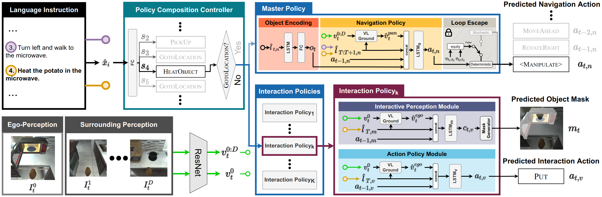

# MCR-Agent
<b> Multi-level Compositional Reasoning for Interactive Instruction Following </b>
 
<a href="https://www.linkedin.com/in/suvaansh-bhambri-1784bab7/"> Suvaansh Bhambri* </a>,
<a href="https://bhkim94.github.io/"> Byeonghwi Kim* </a>,
<a href="http://ppolon.github.io/"> Jonghyun Choi </a>
 
<a href="https://aaai.org/Conferences/AAAI-23/"> AAAI 2023 </a> (to appear)

<b> MCR-Agent </b> (<b>M</b>ulti-level <b>C</b>ompositional <b>R</b>easoning Agent) is a multi-level compositional approach that learns to navigate and manipulate objects in a divide-and-conquer manner for the diverse nature of the entailing task.
MCR-Agent addresses long-horizon instruction following tasks based on egocentric RGB observations and natural language instructions on the <a href="https://github.com/askforalfred/alfred">ALFRED</a> benchmark.
 

The code will be available soon.
